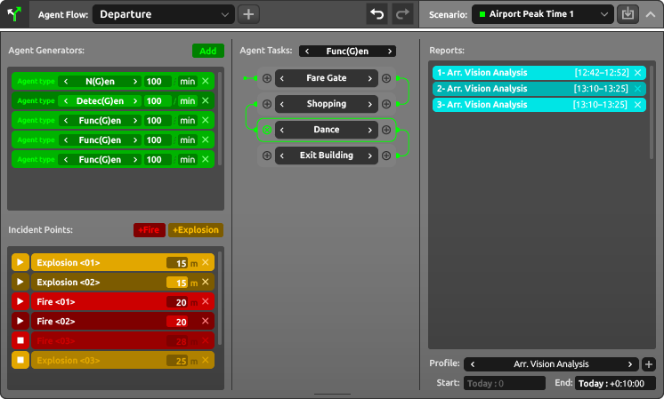

# Tectotrack User Guide

## 1. Introduction
### What is Tectotrack?
Tectotrack is an advanced **crowd simulation** software designed for architects and urban planners. It provides seamless integration with **Autodesk Revit**, eliminating the need for manual environment setup. Users can quickly import Revit models and run crowd simulations for analysis and decision-making.

### Who is Tectotrack for?
Tectotrack is ideal for:
- Architects evaluating pedestrian flow in building designs
- Urban planners optimizing public spaces
- Engineers analyzing emergency evacuation scenarios

### Key Benefits
- **Seamless Revit Integration** – Directly imports and processes Revit models.
- **Automated Metadata Extraction** – Reads project data without requiring manual setup.
- **Real-Time Simulation** – Dynamic agent behavior and emergency scenarios.
- **Advanced Reporting** – Customizable reports with video recording options.

---
## 2. Getting Started
### System Requirements
- **Operating System:** Windows 10/11 (64-bit)
- **Processor:** Intel i7 or AMD equivalent
- **RAM:** 16GB (32GB recommended)
- **Graphics Card:** NVIDIA RTX 3060 or higher
- **Internet Connection:** Required for cloud-based features

### Installation and Setup
1. Download the installer from the official [Tectotrack website](https://tectotrack.com).
2. Run the setup file and follow on-screen instructions.
3. Launch Tectotrack and sign in with your subscription credentials.

### Understanding the UI Layout
#### Main Window 

#### **Title Bar:** Displays software icon and name.

#### **Action Bar:** Includes current project tab, simulation status, and key action buttons.

#### **Viewport:** Displays the 3D environment and simulation.

#### **Navigation Widget:** Tools for zoom, pan, camera management, and level isolation.

#### **Agent Flow Panel:** Controls for defining and managing agent behavior.

---
## 3. Importing an Environment
### 3.1 Create a new project in the **Projects Panel**.
### 3.2 Select the project to open it.
### 3.3 Upload a **Revit (.rvt)** file from your local machine.
### 3.4 Tectotrack processes the file in three steps:
   - **Upload**
   - **Extract Metadata**
   - **Rebuild Mesh**
### 3.5 Once complete, the 3D environment is displayed in the viewport, ready for navigation.

---
## 4. Defining and Running a Simulation
### Agent Flow Setup
- **Creating/Selecting an Agent Flow**: Use the dropdown list to add or choose an agent flow.
- **Setting Agent Generators**:
  - Place generator points in the environment.
  - Define agent types: **Detec(g)en, Func(G)en, or N(G)en**.
  - Adjust **spawn rate** (agents per minute).
- **Adding Emergency Scenarios**:
  - Introduce fire or explosions for evacuation testing.
- **Defining Agent Tasks**:
  - Use the interactive flowchart to define movement logic based on metadata.
- **Saving Scenarios**: Organize different agent flows into scenarios for comparison.

### Running a Simulation
- The **Run/Stop Simulation Button** activates once a scenario is fully set up.
- Start the simulation and observe:
  - Real-time agent movement
  - Click on agents to view their persona/type
  - Enable **PoV Mode** to see from an agent's perspective

---
## 5. Reporting & Analysis
### Generating Reports
- Select an **existing report profile** or create a new one.
- Choose which **cameras** to record from.
- Specify **report types** (charts, heatmaps, path analysis, etc.).
- Set the **time bracket** (duration) for analysis.
- Export reports to a designated local folder.

### Advanced Simulation Monitoring
- Modify cameras and report settings dynamically while the simulation runs.
- Generate new reports at any time to capture different scenarios.

---
## 6. Troubleshooting & Best Practices
### Common Issues & Solutions
- **Slow performance?** Reduce agent count or adjust graphics settings.
- **Import issues?** Ensure the Revit file is correctly formatted.
- **Simulation not starting?** Check if the scenario setup is complete.

### Best Practices
- Use **multiple scenarios** for better analysis.
- Leverage **PoV Mode** to gain deeper insights into agent behavior.
- Regularly update your report profiles for comprehensive results.

---
## 7. Appendices
### Shortcut Keys & Navigation Controls
- **WASD / Arrow Keys** – Move through the environment.
- **Right Mouse Drag** – Rotate view.
- **Mouse Scroll** – Zoom in/out.
- **Ctrl + Click** – Select multiple agents.

### Glossary of Key Terms
- **Agent Flow** – The predefined movement behavior of agents.
- **Scenario** – A saved configuration of agents and environmental conditions.
- **Function Objects** – Elements in the environment that agents interact with.

For further assistance, visit the [Tectotrack Support Page](#).

