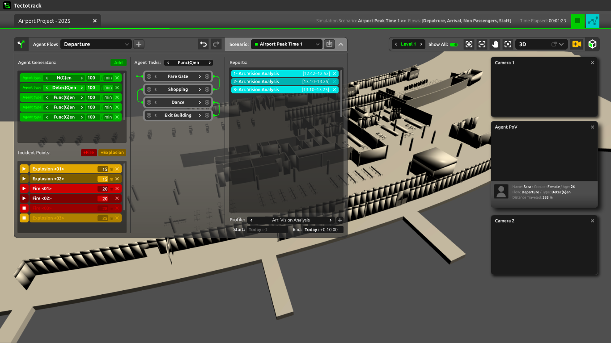

# Tectotrack User Guide

## Introduction
### What is Tectotrack?
**TectoTrack** is the first **social digital twin** — a simulation technology that captures not just the movement of people in space, but the way they **see, interpret, and react** to their environment. It models human behavior in complex settings such as airports, shopping malls, transportation hubs, and public institutions, offering insights grounded in perception and decision-making. 
 
At the core of TectoTrack is a vision-based agent system, enabling each agent to navigate based on what is visible within their field of view. This unique approach goes beyond traditional pathfinding logic by replicating how humans rely on signage, visibility, and spatial cues to make decisions in real time. 
TectoTrack supports a range of agent types, allowing for different levels of behavioral complexity:
- **Func(G)en** agents operate with predefined tasks and logical sequences, simulating routine behavior.
- **Detec(G)en** agents explore unfamiliar environments through vision and memory, gradually building local awareness.
- **N(G)en** agents simulate advanced, human-like reasoning by evaluating their situation and generating decisions through AI-based prompts.

This layered agent architecture allows TectoTrack to simulate both structured and emergent behaviors, providing a powerful tool for designing, evaluating, and optimizing real-world environments with human experience at the center.

### Who is Tectotrack for?
TectoTrack is built for professionals who design, manage, or advise on spaces where human experience matters. From architects and planners to consultants and researchers, TectoTrack empowers teams to understand how people truly interact with their environment — both in future designs and in evaluating existing spaces. 
 
It’s for:
- **Designers & Planners** — to test and optimize layouts, flows, and spatial logic.
- **Facility Managers** — to improve navigation, safety, and operational efficiency.
- **Wayfinding & UX Experts** — to design with visibility and user perception in mind.
- **Consultants** — to support data-driven decisions for complex environments.
- **Researchers** — to study spatial cognition, perception, and behavior.
- **Policy & Safety Teams** — to simulate crowd dynamics and emergency scenarios.

### Key Benefits
- **Real-Time 24/7 Simulation:** Continuously simulate how people move and behave in spaces, at any time of day or operational scenario — from daily activity to high-stress moments.
- **Seamless Revit Integration:** Directly imports and processes Revit models, streamlining your workflow and enabling fast, accurate simulation on real architectural data.
- **Advanced Reporting and Analytics:** Generate customizable reports with visual outputs such as heatmaps, visibility fields, and video recordings to support in-depth spatial analysis and clear stakeholder communication.
- **Inclusivity:** Test and design environments for all users — including those with mobility,visual paiments differences — to ensure equitable access and usability.
- **Advertising Visibility:** Evaluate placement and visibility of advertisements and digital media based on where real attention is likely to fall.
- **Signage and Wayfinding:** Assess the effectiveness of directional systems by tracking how agents interpret and follow visual guidance in complex settings.

---
## Licensing
### 1. Plans
### 2. License Agreemet
### 3. Terms of Service
 

## Installing Tectotrack
### System Requirements
- **Operating System:** Windows 10/11 (64-bit)
- **Processor:** Intel i7 or AMD equivalent
- **RAM:** 16GB (32GB recommended)
- **Graphics Card:** NVIDIA RTX 3060 or higher
- **Internet Connection:** Required for cloud-based features

### Installation and Setup
1. Download the installer from the official [Tectotrack website](https://tectotrack.com).
2. Run the setup file and follow on-screen instructions.
3. Launch Tectotrack and sign in with your subscription credentials.

## User Interface
### Window System
After starting Tectotrack, signig in, and set up new project or open previous one, the Tectotrack window should look similar to the image below.

The default Tectotrack interface.

<!-- #### **Title Bar:** Displays software icon and name.

#### **Action Bar:** Includes current project tab, simulation status, and key action buttons.

#### **Viewport:** Displays the 3D environment and simulation.

#### **Navigation Widget:** Tools for zoom, pan, camera management, and level isolation.

#### **Agent Flow Panel:** Controls for defining and managing agent behavior.
 -->

---
### Importing an Environment
#### 1. Create a new project in the **Projects Panel**.
#### 2. Select the project to open it.
#### 3. Upload a **Revit (.rvt)** file from your local machine.
#### 4. Tectotrack processes the file in three steps:
   - **Upload**
   - **Extract Metadata**
   - **Rebuild Mesh**
#### 5. Once complete, the 3D environment is displayed in the viewport, ready for navigation.

---
### Defining and Running a Simulation
#### **Agent Flow Setup**
- **Creating/Selecting an Agent Flow**: Use the dropdown list to add or choose an agent flow.
- **Setting Agent Generators**:
  - Place generator points in the environment.
  - Define agent types: **Detec(g)en, Func(G)en, or N(G)en**.
  - Adjust **spawn rate** (agents per minute).
- **Adding Emergency Scenarios**:
  - Introduce fire or explosions for evacuation testing.
- **Defining Agent Tasks**:
  - Use the interactive flowchart to define movement logic based on metadata.
- **Saving Scenarios**: Organize different agent flows into scenarios for comparison.

#### **Running a Simulation**
- The **Run/Stop Simulation Button** activates once a scenario is fully set up.
- Start the simulation and observe:
  - Real-time agent movement
  - Click on agents to view their persona/type
  - Enable **PoV Mode** to see from an agent's perspective

---
## 5. Reporting & Analysis
### Generating Reports
- Select an **existing report profile** or create a new one.
- Choose which **cameras** to record from.
- Specify **report types** (charts, heatmaps, path analysis, etc.).
- Set the **time bracket** (duration) for analysis.
- Export reports to a designated local folder.

### Advanced Simulation Monitoring
- Modify cameras and report settings dynamically while the simulation runs.
- Generate new reports at any time to capture different scenarios.

---
## 6. Troubleshooting & Best Practices
### Common Issues & Solutions
- **Slow performance?** Reduce agent count or adjust graphics settings.
- **Import issues?** Ensure the Revit file is correctly formatted.
- **Simulation not starting?** Check if the scenario setup is complete.

### Best Practices
- Use **multiple scenarios** for better analysis.
- Leverage **PoV Mode** to gain deeper insights into agent behavior.
- Regularly update your report profiles for comprehensive results.

---
## 7. Appendices
### Shortcut Keys & Navigation Controls
- **WASD / Arrow Keys** – Move through the environment.
- **Right Mouse Drag** – Rotate view.
- **Mouse Scroll** – Zoom in/out.
- **Ctrl + Click** – Select multiple agents.

### Glossary of Key Terms
- **Agent Flow** – The predefined movement behavior of agents.
- **Scenario** – A saved configuration of agents and environmental conditions.
- **Function Objects** – Elements in the environment that agents interact with.

For further assistance, visit the [Tectotrack Support Page](#).

